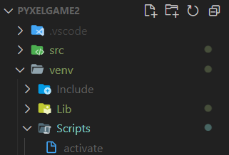

# The Game

game using [**Pyxel**](https://github.com/kitao/pyxel) and **python**

____

## Running program

First you need to activate virtual environment...



```cmd
cd venv
cd Scripts
activate
```

...then back to project directory

```cmd
cd ..
cd ..
```

To run game

```cmd
pyxel run game
```

To run editor

```cmd
pyxel edit
```
